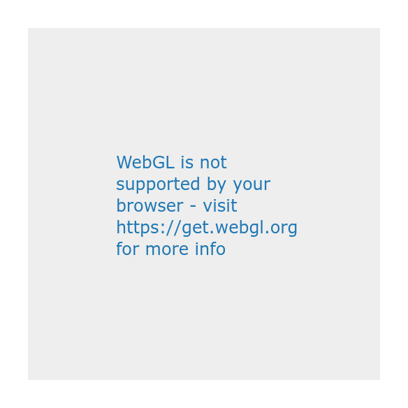

### This is the basic information


```r
ptp
```

```
## Fontconfig warning: ignoring UTF-8: not a valid region tag
```



*** 
Some weird description

- one
- two

### Total UMI


```r
ptp
```

```
## Fontconfig warning: ignoring UTF-8: not a valid region tag
```


***
Some other stuff

### Total UMI


```r
ptp
```

```
## Fontconfig warning: ignoring UTF-8: not a valid region tag
```


